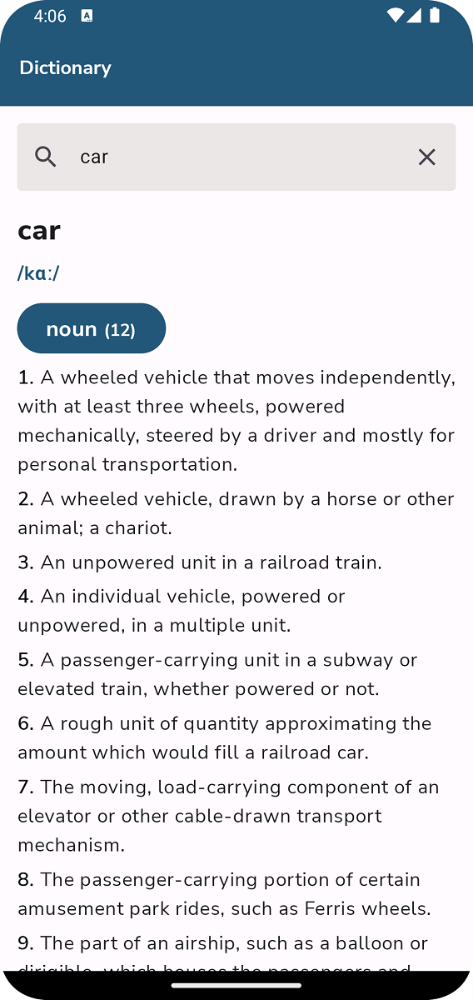
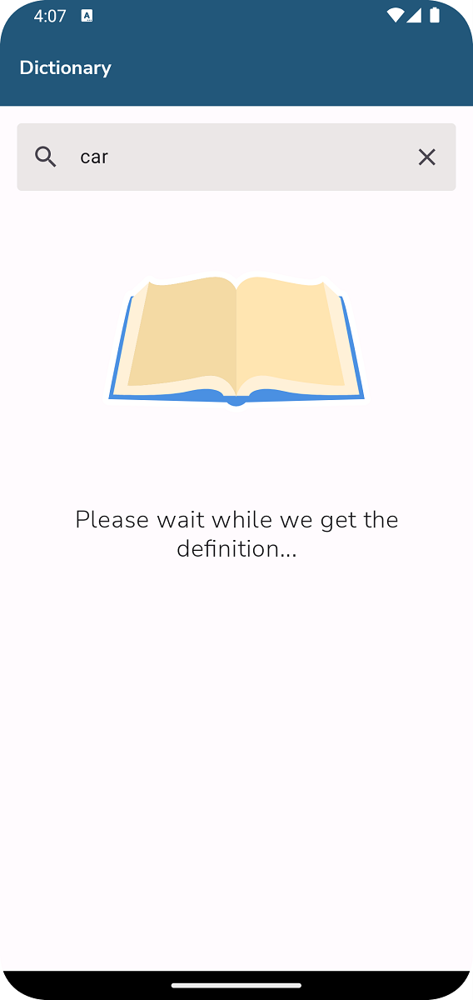

# Dictionary App
A dictionary application to allow you find definition of words and enhance your vocabulary

the technologies used in this project consist of:

1.kotlin

2.Jetpack compose 

3.Hilt

4.Flow 

5.coroutines

6.Retrofit

7.RoomDb

8.MVVM

## Demo

### Home Screen
 

### Architecture
To decouple the business logic from the UI I opted to use the MVVM design pattern that lead to the codebase seeing benefits like:

* Increased testability of the UI and business logic separately
* Increased maintainability and readability due to the less decoupling of classes
* Allowed as to implement unidirectional data flow that reduced bugs since we had one single source of truth

